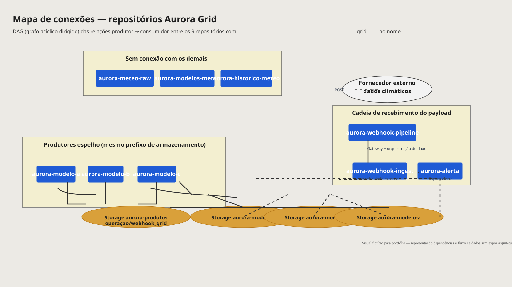

# Designing Operational Visibility

### Service Operations & Technical Backstage

> **Como reduzir o tempo e o esforço necessários para identificar onde uma informação crítica deixou de chegar e permitir que a operação retome sua atividade mais rapidamente?**

## Sobre

Case de portfólio sobre melhoria de processos e Service Operations. Parte de uma situação simples: um analista precisa de um indicador para trabalhar e ele não está disponível. A partir daí, mostra como a falta de visibilidade sobre fluxos de dados, dependências e ownership transforma uma falha técnica em esforço e atraso operacional.

O Data Lineage é usado como ponte entre o backstage técnico e a experiência de quem depende dele.

## Disclaimer

Projeto **fictício**, desenvolvido exclusivamente para portfólio. Empresa, sistemas, repositórios, fluxos, incidentes e soluções são inventados. Nenhuma arquitetura, informação confidencial ou dado de empresas reais é utilizado. As métricas descrevem como o sucesso seria medido; não são resultados observados.

## Como navegar

1. [Resumo executivo](portfolio/resumo-executivo.md)
2. [Board do case — 15 frames](portfolio/00-board/index.md)
3. [Data Lineage e BPMN fictícios](portfolio/04-data-lineage/index.md)
4. [Métricas](portfolio/07-metricas/index.md)
5. [Visuais](portfolio/08-visuais/index.md)

## Visual

## Abordagem

Process Mapping, Service Design, Service Blueprint, Data Lineage, Dependency Mapping e Root Cause Analysis, aplicados a um único data asset fictício (Daily Energy Indicator) e a um único cenário de falha.
