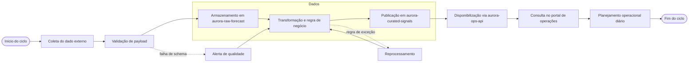

# BPMN fictício do processo de dados

Este diretório apresenta uma visão do processo de mapeamento de dados em formato BPMN-fictício, alinhado ao fluxo de lineage do caso. O objetivo é mostrar como o dado é capturado, transformado, validado e entregue para a operação sem expor arquitetura real.

## Visão geral

O processo começa na coleta do dado externo e termina no consumo operacional, passando por validação, normalização e disponibilização para a camada de decisão.

## Diagrama de processo

## Mapeamento de dados

| Etapa | Sistema fictício | Entrada | Transformação | Saída | Responsável |
|---|---|---|---|---|---|
| 1 | aurora-source-ingest | payload externo | coleta e empacotamento | lote bruto | Integração |
| 2 | aurora-raw-forecast | lote bruto | registro por data e origem | dado raw | Dados |
| 3 | aurora-transform-grid | dado raw | validação, padronização, normalização | dado tratado | Engenharia de Dados |
| 4 | aurora-curated-signals | dado tratado | regras de negócio e qualidade | dado confiável | Dados de Operação |
| 5 | aurora-ops-api | dado confiável | expõe API interna | endpoint operacional | Produto Operacional |
| 6 | aurora-portal-operacoes | API de operação | apresentação e contexto visual | painel de decisão | Operações |

## Riscos de processo

- falha no payload recebido pela etapa inicial;
- dados incompletos em camada raw;
- regra de negócio inválida na transformação;
- atraso na disponibilização para o painel operacional;
- dependência crítica de mais de uma camada antes do consumo final.

## Objetivo do material

Esse BPMN fictício foi construído para ilustrar o processo de dados e a cadeia de dependência em linguagem de portfólio, sem expor o ambiente real.
