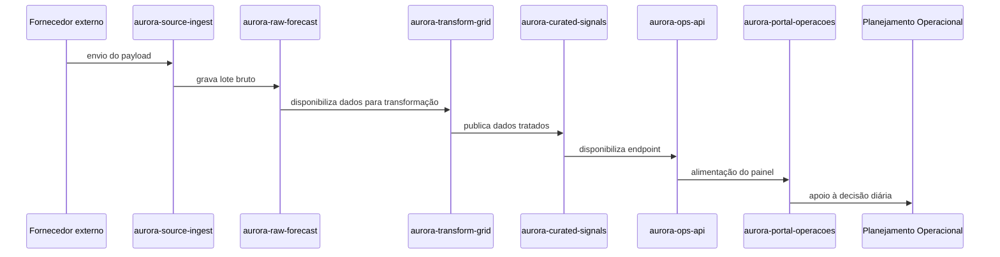

# Processo BPMN e mapeamento de dados

## Descrição narrativa

O processo operado em um ciclo diário começa com a ingestão de dados externos. Esses dados passam por uma série de passos de validação, armazenamento em camada raw, transformação em dado confiável e disponibilização para o time operacional.

## Fluxo em linguagem BPMN

## Mapeamento de responsabilidades

- Fonte externa: entrega payload em intervalos regulares
- Integração: coleta o dado e valida formato inicial
- Dados: mantém histórico e rastreabilidade em camada raw
- Engenharia: aplica regras de qualidade e transformação
- Produto Operacional: disponibiliza dados em interface consumível
- Operações: usa a informação para decidir e agir no dia-a-dia

## Indicador de criticidade

- Grau de dependência: alto
- Impacto de falha: interrupção do processo operacional
- Sensibilidade: alta, porque o dado afeta a priorização e as decisões do planejamento

## Conclusão

A estrutura do processo mostra que o problema não está apenas na ausência de dado, mas na fragilidade da cadeia de dependência entre as camadas de ingestão, transformação e consumo.
