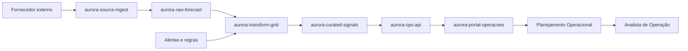

# Lineage fictícia de repositórios

Este diretório contém um exemplo fictício de data lineage para uso em portfólio. Os nomes e fluxos abaixo não representam arquitetura real e foram criados apenas para demonstrar a narrativa do caso.

## Asset principal

- Nome do dado: Daily Energy Indicator
- Finalidade: alimentar a operação diária de planejamento e decisão
- Criticidade: alta
- Frequência: diária
- Dono: Coordenação de Operações

## Fluxo ilustrado

## Repositórios fictícios

| Repositório | Camada | Função | Dono |
|---|---|---|---|
| aurora-source-ingest | source | coleta dados externos e payloads de entrada | Integração |
| aurora-raw-forecast | raw | armazena dados brutos por data e origem | Dados |
| aurora-transform-grid | transformations | valida, normaliza e consolida registros | Engenharia de Dados |
| aurora-curated-signals | curated | publica conjunto confiável para consumo | Dados de Operação |
| aurora-ops-api | serving | expõe dados para aplicações internas | Produto Operacional |
| aurora-portal-operacoes | consumer | apresenta indicadores nos painéis operacionais | UX e Operações |

## Observação

Este exemplo foi pensado para apresentar a lógica de lineage e dependência entre repositórios sem expor detalhes reais de infraestrutura.
